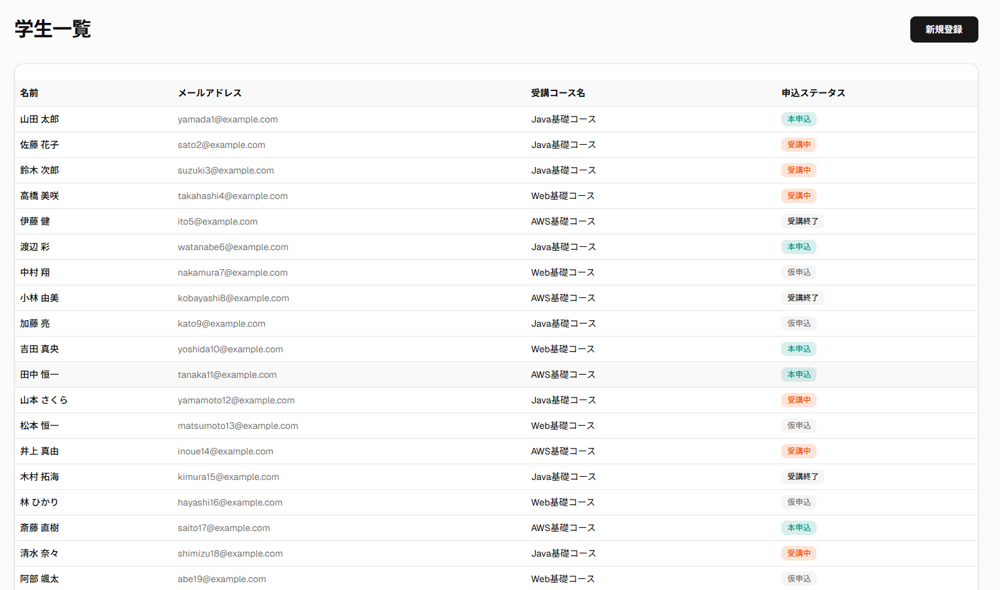
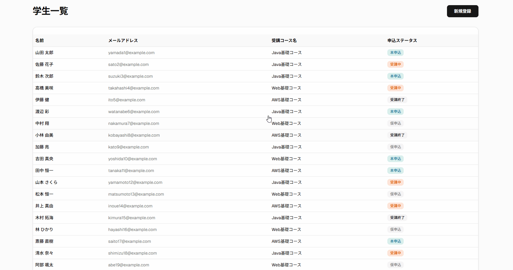
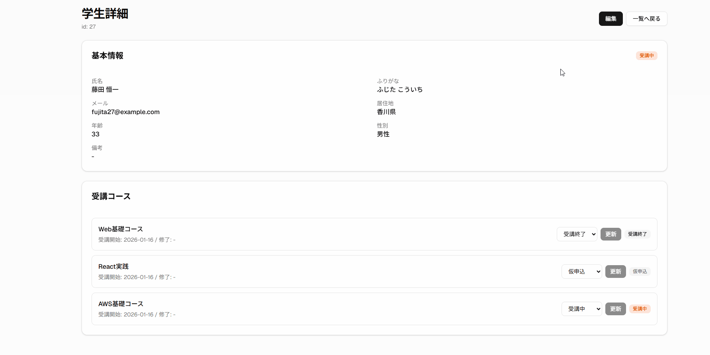
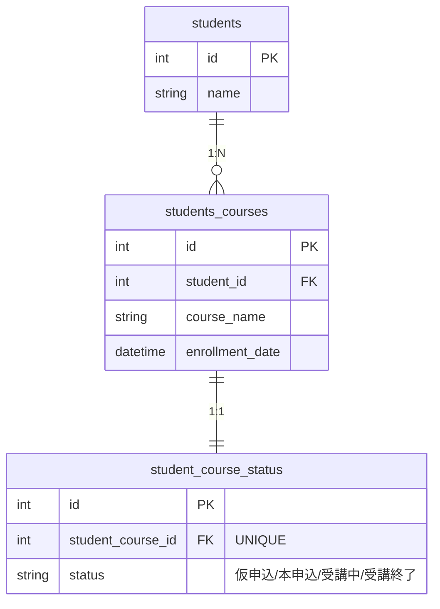
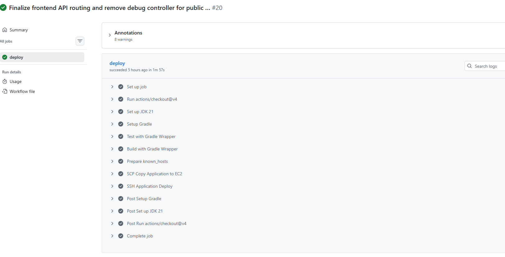

  

# Student Management System

## 制作背景

---
本アプリは、受講生情報・コース・申込ステータスといった
複数の情報を扱う管理業務を題材に、
「情報の分離」と「状態管理の分かりやすさ」を意識して設計した
学習用Webアプリケーションです。

受講生管理という一見シンプルな題材でも、
実際には「基本情報」「受講コース」「申込状態」など
性質の異なる情報が混在しやすく、
設計次第では保守性や拡張性が低下すると感じました。

そこで本アプリでは、
受講生・コース・申込ステータスをそれぞれ独立した関心事として捉え、
ドメインを分離した設計を行いました。
また、フロントエンド実装を見据え、
REST API を中心としたバックエンド構成としています。

学習を進める中で設計の見直しやAPIの修正を重ねることで、
「要件整理 → 実装 → 改善」という
実務に近い開発サイクルを意識して取り組みました。

## アプリケーションURL

---
https://student-management-beryl-sigma.vercel.app/students

受講生情報・コース・申込状態を一元管理する Web アプリケーションです。  
バックエンドに **Java / Spring Boot**、フロントエンドに **Next.js** を採用し、  
**REST API を介したフロントエンド／バックエンド分離構成**で実装しています。

単純な CRUD に留まらず、  
UI 設計・データ設計・テスト・CI/CD を含めた  
アプリケーション開発全体の流れを意識して構築しました。

  

## 機能

---
### 業務機能
- 受講生一覧表示
- 受講生詳細表示
- 受講生情報の新規登録・編集
- コース申込ステータス管理（仮申込 / 本申込 / 受講中 / 受講終了）

### 技術要素
- REST API（JSON）
- 自動テストおよび CI/CD による自動デプロイ

### 受講コース・申込ステータスの更新（一覧画面）

  

一覧画面上のプルダウン操作により、  
受講コースおよび申込ステータスを即時に更新できます。

頻繁に発生する操作を画面遷移なしで完結できるよう設計し、  
フロントエンドから利用しやすい API 構成としています。

### 受講生基本情報の編集（詳細・編集画面）

---

  

受講生の氏名・年齢・居住地などの基本情報は、  
専用の編集画面からまとめて変更できる構成としています。

また、受講コースごとの申込ステータスは詳細画面上で管理し、  
1 人の受講生が複数コースを持つケースにも対応しています。

## 技術スタック

---
### バックエンド
- Java 21
- Spring Boot
- MyBatis
- Gradle
- JUnit / Mockito

### フロントエンド
- Next.js
- React

### インフラ / CI
- AWS EC2
- GitHub Actions（テスト / ビルド / デプロイ）

---

## システム構成

---
### ER図（データモデル）

students / students_courses / student_course_status の関係を示しています。

受講履歴（students_courses）と、
更新頻度の高い申込ステータス（student_course_status）を分離し、
状態管理の拡張性を考慮した設計としています。

### システム構成図（アーキテクチャ）

  

フロントエンドとバックエンドを REST API で疎結合に分離し、
CI/CD により EC2 上へ自動デプロイする構成としています。

## API 設計

---
- REST API による JSON 通信
- Controller / Service / Repository を分離したレイヤード設計
- フロントエンドからの利用を前提とした API 構成
- HTTP ステータスコードを考慮したレスポンス設計

## 実行・デプロイ構成（CI/CD）

---
GitHub Actions により、main ブランチへの merge を契機に
上記 URL のアプリケーションが自動的に更新されます。

- テスト実行
- ビルド成果物（JAR）の生成
- EC2 への転送およびアプリケーションの再起動

  

サーバー再起動時にもアプリケーションが自動起動する構成とし、
手動操作を必要としない運用を実現しています。

## 品質・テスト設計

---
サービス層を中心にユニットテストを実装し、
ビジネスロジックをテスト可能な形で分離しています。

### 入力チェック・バリデーション

フロントエンドでは入力チェックによる即時フィードバックを行い、
バックエンドでは Bean Validation により不正データの登録を防止しています。

これにより、UI に依存しない形で
API 単体でもデータ整合性が担保される構成としています。

## 補足事項

---
- 認証・認可（ログイン機能）は未実装
- DB 接続が必須
- 機能追加・UI 改善を前提とした構成
