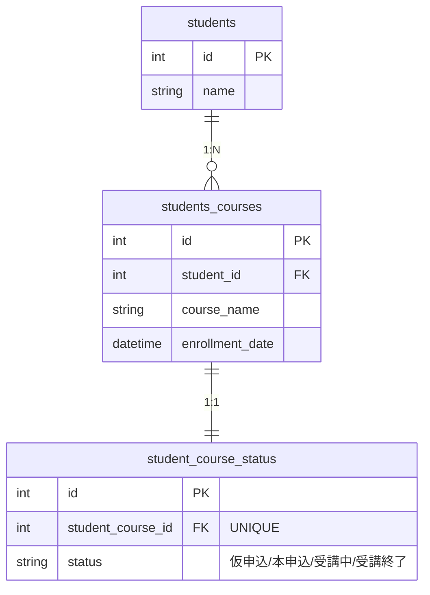
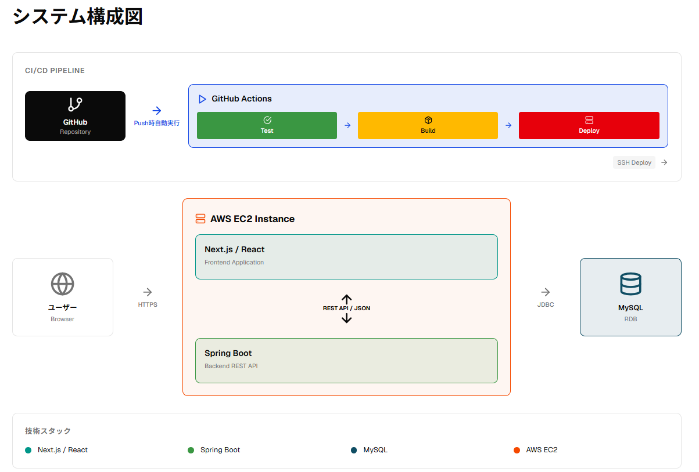

# Student Management System
<!--
【画像差し込み予定】
アプリのトップ画面（受講生一覧 or 詳細画面）
README の第一印象用スクリーンショット
-->

受講生・コース・申込状態を一元管理する Web アプリケーションです。  
REST API を中心に設計し、フロントエンド／バックエンド分離構成で実装しています。  
CI/CD を含むアプリケーションの運用フローを意識して構成しています。

---

## 機能

<!--
【画像/GIF差し込み予定】
・受講生一覧 → 詳細 → 編集 → 保存 の操作GIF
-->

- 【業務機能】
  - 受講生一覧表示
  - 受講生詳細表示
  - 受講生情報の新規登録・編集
  - コース申込ステータス管理（仮申込 / 本申込 / 受講中 / 受講終了）
- 【技術要素】
  - REST API（JSON）提供
  - 自動テストおよび自動デプロイ（CI/CD）

---

## アプリケーション概要

<!--
【画像差し込み予定】
画面構成図 
-->

受講生一覧 / 詳細 / 編集画面を提供します。

一覧から詳細へ遷移し、編集操作を行う流れを想定しています。

---

## 技術スタック

### バックエンド
- Java 21
- Spring Boot
- MyBatis
- Gradle
- JUnit / Mockito

### フロントエンド
- Next.js
- React

### インフラ / CI
- AWS EC2
- GitHub Actions（テスト / ビルド / デプロイ）

---

## システム構成

### ER図（データモデル）

students / students_courses / student_course_status の関係を示しています。

students_courses を受講履歴（中間）として持ち、コースごとの状態は student_course_status に 1:1 で分離しています。

受講登録データと更新頻度の高いステータスデータを分離し、拡張性を考慮した設計です。

### システム構成図（アーキテクチャ）

  

フロントエンド（Next.js）とバックエンド（Spring Boot）を REST API により疎結合に分離し、
CI/CD による自動デプロイおよび EC2 上での常駐運用を想定した構成としています。

---

## API 設計
- REST API による JSON 通信
- Controller / Service / Repository を分離したレイヤード設計
- バリデーションおよび例外処理を考慮した実装
- API はフロントエンドからの利用を前提として設計
- HTTP ステータスコードを考慮したレスポンス設計

---

## 実行・デプロイ構成（CI/CD）

本アプリケーションは、GitHub Actions を用いた CI/CD により  
EC2 上へ自動デプロイされ、  サーバー再起動時にも自動でアプリケーションが起動・常駐する構成としています。

- main ブランチへの push をトリガーに CI/CD を実行
- テスト成功後、成果物（JAR）を EC2 に配置
- アプリケーションを自動起動・常駐実行

これにより、手動での起動操作を行うことなく  
常に最新の状態でアプリケーションが稼働する構成となっています。

<!--
【画像差し込み予定】
GitHub Actions の実行結果（CI/CD 成功画面）
-->

---

## 品質・テスト設計

バックエンドでは、サービス層およびリポジトリ層を中心に  
ユニットテストを実装しています。

- ビジネスロジックをサービス層に集約
- データアクセス層は MyBatis を用いて分離
- Mockito を利用した依存関係のモック化

これらのテストは GitHub Actions 上で自動実行され、  
デプロイ前に品質が担保される構成としています。

---

## 補足事項
- 認証・認可（ログイン機能）は未実装
- DB 接続が必須
- 機能追加・UI 改善を前提とした構成
